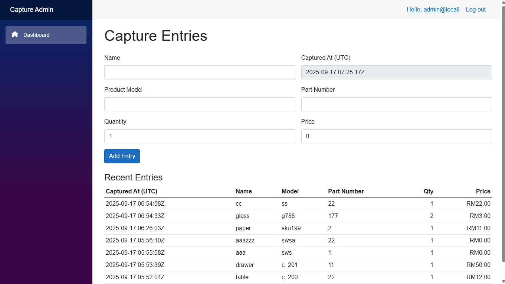
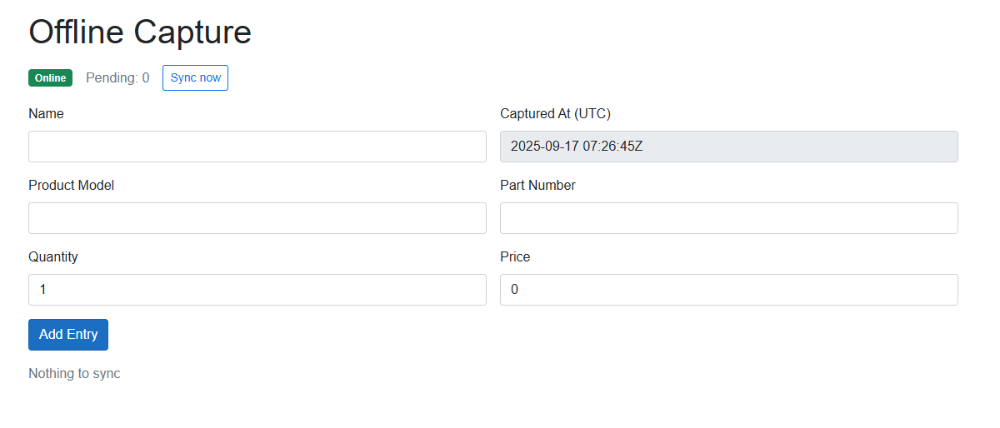

# Blazor Data Capture

An offline-first data capture system that pairs a Blazor Server back office with a Blazor WebAssembly PWA for field operators. The server hosts authentication, administration, and REST APIs backed by SQL Server. The PWA queues entries in IndexedDB when offline and syncs when connectivity resumes.

## Running the Apps

### Server (Blazor Server + APIs)

1. Install the .NET 8 SDK and ensure SQL Server is available.
2. From the repo root run the database migrations: `dotnet ef database update --project src/Server --startup-project src/Server`.
3. Start the server: `dotnet run --project src/Server`. It listens on `https://localhost:5001` (and `http://localhost:5000`) and hosts the admin UI, Identity, and REST endpoints.

### Client (Blazor WebAssembly PWA with offline capture)

The PWA can operate without connectivity by caching data in IndexedDB and syncing when the network returns.

1. Open a new terminal and navigate to `src/Client.Wasm`.
2. Run `dotnet run --launch-profile https` to start the development server on `https://localhost:5003`.
3. Sign in via the server (`https://localhost:5001/Identity/Account/Login`); the PWA will redirect there automatically if you’re not authenticated.
4. Capture entries at `https://localhost:5003`. When offline the app queues submissions locally and flushes them once it detects connectivity.

For production, publish the PWA (`dotnet publish src/Client.Wasm -c Release`) and serve the generated static files from the server or a CDN so both experiences share a single origin.

Default credentials are seeded for `admin@local` with password `Change_this1!`. Update the password immediately.
